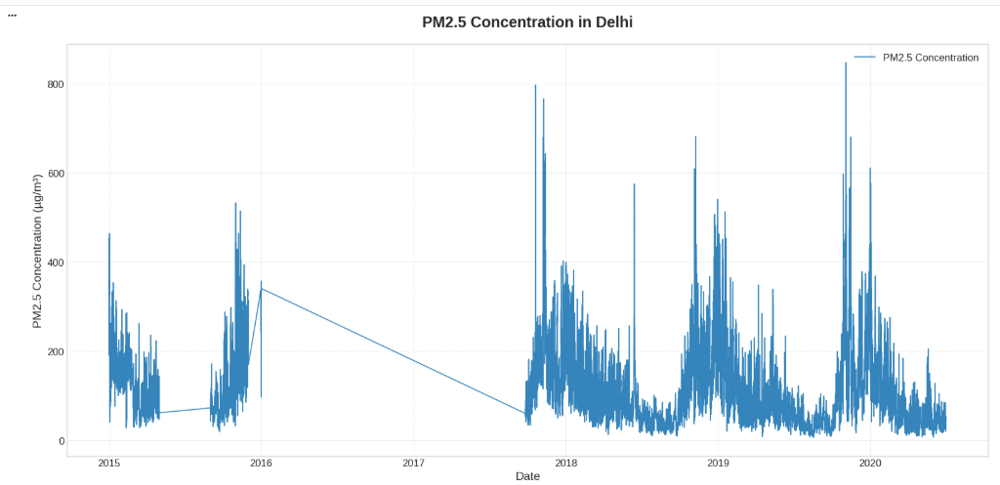
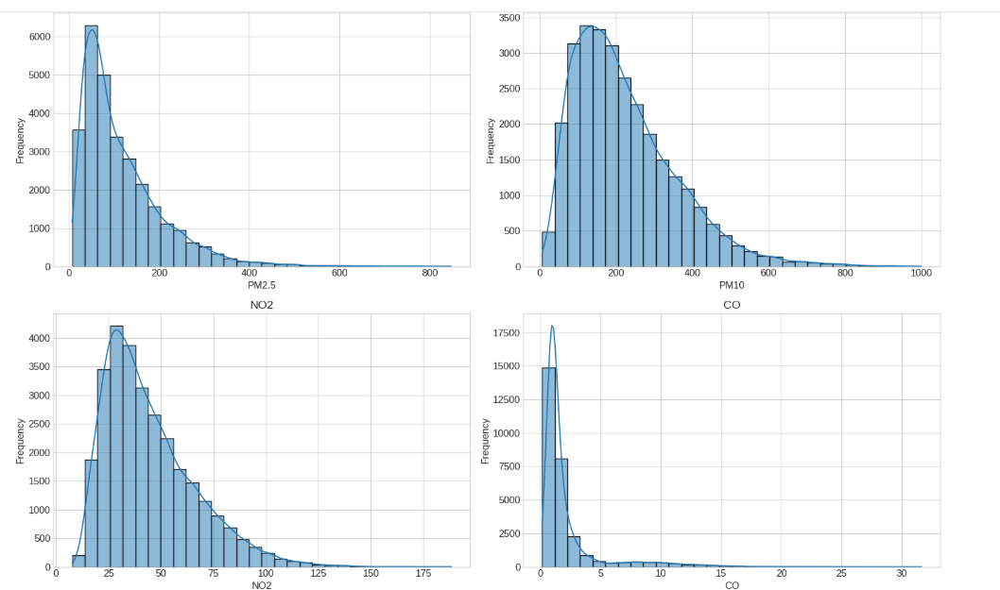
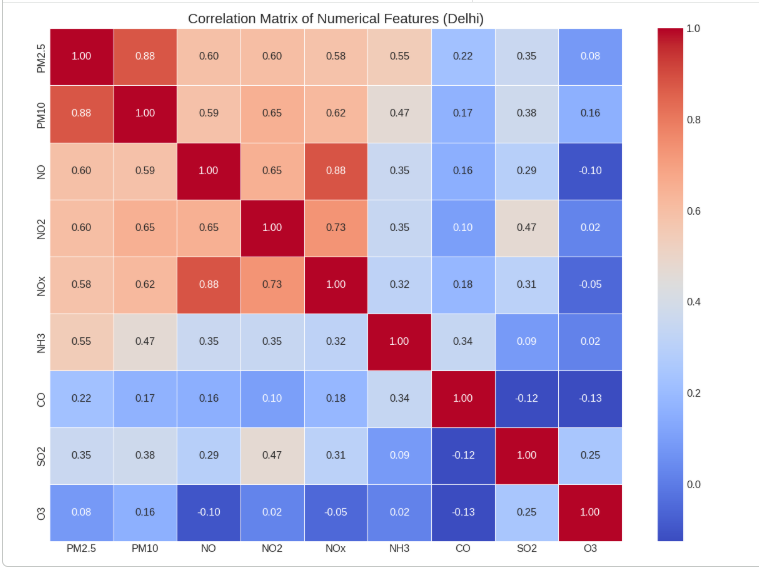
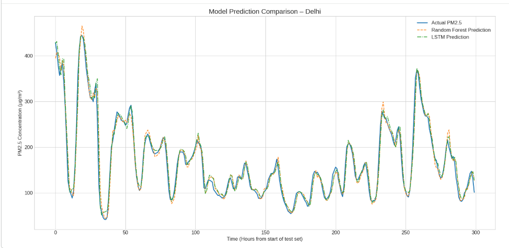

# Delhi Air Quality Prediction (PM2.5 Forecasting)

## Project Overview

This project focuses on predicting **PM2.5 air pollution levels in Delhi** using **machine learning and deep learning techniques**.

The notebook performs:

- Data preprocessing
- Exploratory Data Analysis
- Feature correlation analysis
- Time-series preparation using sliding windows
- Model training using:
  - Random Forest
  - LSTM (Long Short-Term Memory Neural Network)

The goal is to predict **future PM2.5 concentration levels based on historical air pollution data.**

---

# Dataset

Dataset used:

**Delhi Air Quality Hourly Dataset**

The dataset contains hourly measurements of air pollutants including:

| Pollutant | Description             |
| --------- | ----------------------- |
| PM2.5     | Fine particulate matter |
| PM10      | Particulate matter      |
| NO        | Nitric oxide            |
| NO2       | Nitrogen dioxide        |
| NOx       | Nitrogen oxides         |
| NH3       | Ammonia                 |
| CO        | Carbon monoxide         |
| SO2       | Sulfur dioxide          |
| O3        | Ozone                   |

---

# Project Workflow

The project follows a typical **data science lifecycle**:

1. Data Collection
2. Data Cleaning
3. Exploratory Data Analysis
4. Feature Scaling
5. Time Series Windowing
6. Model Training
7. Model Evaluation
8. Prediction Visualization

---

# Exploratory Data Analysis

## PM2.5 Trend Over Time

This plot shows how PM2.5 concentration changes over time.

---

## Distribution of Air Pollutants

Distribution plots show how different pollutants vary across time.

---

## Correlation Heatmap

Correlation analysis helps understand relationships between pollutants.

Key observations:

- PM2.5 strongly correlates with **PM10 and NOx**
- Some pollutants have weak relationships with PM2.5

---

# Data Preparation

## Feature Scaling

To improve model performance, the data is normalized using:

**MinMaxScaler**

This scales all features between **0 and 1**.

---

## Sliding Window Technique

Time-series prediction requires using past observations to predict future values.

A **24-hour look-back window** is used.

Example:

Input: previous 24 hours pollution data  
Output: next hour PM2.5 value

---

# Models Implemented

## 1. Random Forest Regressor

Random Forest is an ensemble learning method using multiple decision trees.

Model parameters used:

- `n_estimators = 200`
- `max_depth = 15`
- `min_samples_split = 10`

Advantages:

- Handles nonlinear relationships
- Robust to overfitting
- Works well with tabular data

---

## 2. LSTM Neural Network

LSTM is designed for **time-series and sequential data**.

Architecture:
LSTM (64 units)
Dropout (0.2)
LSTM (32 units)
Dropout (0.2)
Dense (1 output)

Advantages:

- Captures temporal dependencies
- Effective for long-term patterns
- Suitable for sequential pollution data

---

# Model Prediction Comparison

The following graph compares:

- Actual PM2.5 values
- Random Forest predictions
- LSTM predictions

---

# Model Evaluation Metrics

The models are evaluated using:

- MAE (Mean Absolute Error)
- RMSE (Root Mean Squared Error)
- R² Score

These metrics measure prediction accuracy and model performance.

---

# Technologies Used

- Python
- Pandas
- NumPy
- Matplotlib
- Seaborn
- Scikit-Learn
- TensorFlow / Keras
- Google Colab

---

# Project Structure

Delhi-Air-Quality-Prediction
│
├── delhi.ipynb
├── delhi_air_quality_hourly.csv
├── README.md
│
└── images
├── pm25_trend.png
├── distribution_plots.png
├── correlation_heatmap.png
└── model_predictions.png
